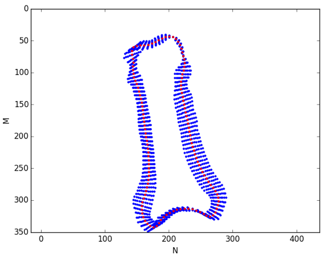

# ShapeModels

[](https://travis-ci.org/rened/ShapeModels.jl)

This package is meant to assemble methods for handling 2D and 3D statistical shape models, which are often used in medical computer vision.

Currently, PCA based shape models are implemented, as introduced by Cootes et al<sup>1</sup>.

Given a set of *shapes* of the form `ndim x nlandmarks x nshapes`, a PCA shape model is constructed using:

```jl
model = PCAShapeModel(landmarks)

shapes = modeshapes(a,1)  # examples for first eigenmode
[plotshape(shapes[:,:,i],"b.") for i = 1:10]
plotshape(meanshape(a),"r.")
```

Example computed with outlines of metacarpal bones:



## Functions

* `model = PCAShapeModel(shapes)` compute a shape model
* `nmodes(model)` get number of modes of the model, including rotation, scaling and translation
* `shape(model, coeffs)` compute a shape given a vector `coeffs` of `length(nmodes(a))`
* `meanshape(model)` get the shape which represents the mean of all shapes
* `modeshapes(model, mode)` get 10 shapes from -3std to 3std of mode number `mode`

Helper functions for plotting. They require the `PyPlot` package to be installed.

* `axisij()` set the origin to top-left
* `plotshape(shape)` plot a single shape
* `plotshapes(shapes)` plot several shaped in individual subfigures


<small><sup>1</sup> T.F. Cootes, D. Cooper, C.J. Taylor and J. Graham, "Active Shape Models - Their Training and Application." Computer Vision and Image Understanding. Vol. 61, No. 1, Jan. 1995, pp. 38-59.</small>

